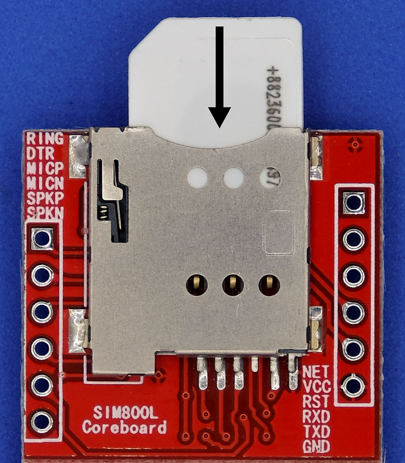
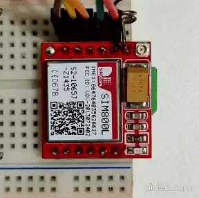
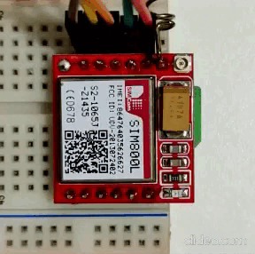

# SIM800L-GPRS-connect

###Simple coding to connect sim800l in GPRS and send HTTP Get Request.

#### I used a M2M sim card to connect to the GPRS network, but you can try other SIM card types, that has internet connection.

<div style="text-align: center; padding: 4px;">
    <h5>SIM position</h5>
    <p style="align: center;">
        
    </p>    
</div>

#### Connections & pinouts
Arduino Mega / Uno  |   Sim800l   |    Notes  
-------------|-------------|------------
+5v| 3.8v ~ 4.4v| Power supply input
10 RX_PIN | TX |  
11 TX_PIN | RX |
4   RESET_PIN | RST| Reset Pin
GND | GND | If module sim800l connected at external supply, connect GND external supply to arduino too.

#### Functions
Name | Return  |   Notes   
-------------|-------------|------------|
send_command_sim800l( String command, int timeout = 1000 )| Boolean  | Send commands to sim800l, set timeout and verify receipt. If module receives return true, else return false
gprs_config() |  Void | Send basic settings commands to connect at GPRS 
gprs_send_get( String payload ) |  Void | Send payload to your URL with HTTP GET.

#### Set your chip(SIM) settings to connect on APN 
```c++

String apn = "APN";                           //APN
String apn_u = "APN-Username";                //APN-Username
String apn_p = "APN-Password";                //APN-Password

```
#### Set your URL API 
```c++

String url = "http://YOUR-API.com/";          //URL of API

```

#### LED Blink Status

<table>
  <tr>
    <td style="text-align: center;">
        <h5>Looking at Network Signal</h5>
        <p style="align: center;">
            
        </p>
    </td>
    <td style="text-align: center;">
        <h5>Connected to Network</h5>
        <p style="align: center;">
            
        </p>
    </td>
    <td style="text-align: center;">
        <h5>Connected to GPRS</h5>
        <p style="align: center;">
            
        </p>    
    </td>
  </tr>
</table>
